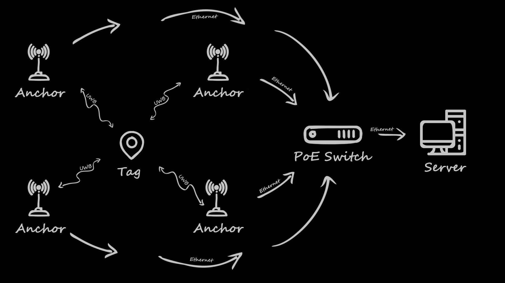

Source code for Open-RTLS nodes (anchor, tag) based on STM32 microcontrollers. 

Open-RTLS supports TWR and TDOA modes. 

Communication scheme of RTLS units:

Anchor nodes are based on STM32F207 microcontrollers and have ethernet interface. Both anchors and tags have USB interface for connection with configuartion software.

To setup network and RTLS parameters of nodes use [Open-RTLS Configurator](https://github.com/DemianZ/UWB-Open-RTLS-Configurator).


##### Generate .c and .h proto files from .proto file using Nanopb:

```bash
pip install protobuf grpcio-tools
python proto/nanopb_generator.py -v proto/Settings.proto
```
